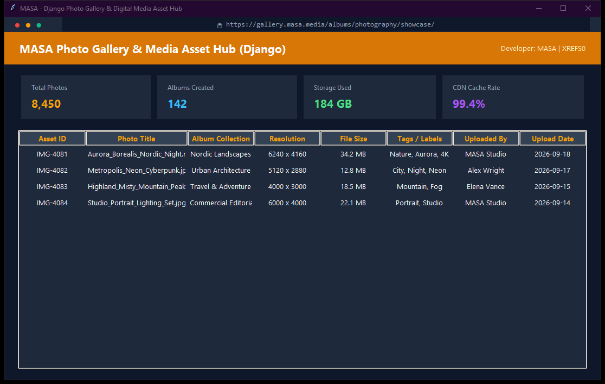

# Photo Gallery & Media Asset Hub

Dynamic digital asset and photography gallery application built with Django featuring albums, tagged search, image preview, and secure upload pipelines.

---

## Preview



---

## Technical Specifications

- **Language**: Python 3.11+
- **Architecture**: Modular Desktop / Web System
- **Technologies**: Django 4+, SQLite, Pillow, Bootstrap, Python 3.11
- **Lead Developer**: MASA
- **License**: MIT (Licensed to XREFS0)

---

## Key Features

- **Architectural Excellence**: Clean separation between presentation layer, business logic, and database storage.
- **Robust Persistence**: Engineered with structured schemas, data validation, and transactional integrity.
- **Developer-Centric Codebase**: Strict PEP 8 styling formatted with Black, comment-free production code.
- **Extensible Schema**: Designed to easily accommodate future schema migrations or RESTful API expansions.

---

## Installation & Setup

1. **Clone the repository**:
   ```bash
   git clone https://github.com/XREFS0/masa-django-photo-gallery.git
   cd masa-django-photo-gallery
   ```

2. **Set up virtual environment (optional but recommended)**:
   ```bash
   python -m venv venv
   source venv/bin/activate  # On Windows: venv\Scripts\activate
   ```

3. **Install dependencies**:
   ```bash
   pip install -r requirements.txt
   ```
   *(If `requirements.txt` is not provided, ensure required standard libraries or Django / Pillow / Tkinter are available)*

4. **Launch the application**:
   ```bash
   python manage.py runserver
   ```

---

## Author & Copyright

- **Developer**: MASA
- **Copyright**: (c) 2026 XREFS0. All rights reserved under the MIT License.
